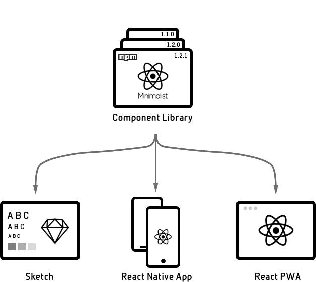

<div align="center">

# react-native-minimalist


</div>

---

[](https://travis-ci.org/applification/react-native-minimalist)
[](https://codecov.io/gh/applification/react-native-minimalist)
[](https://www.npmjs.com/package/react-native-minimalist)
[](http://npm-stat.com/charts.html?package=react-native-minimalist)
[](http://opensource.org/licenses/MIT)
[](https://github.com/prettier/prettier)

> **Status**: Alpha (In development, do not use in production).

---

## The Problem

You want to use the same React components across React & React Native, maybe even Sketch and React VR.

## The Solution

A React component library that utilises [React Primitives](https://github.com/lelandrichardson/react-primitives) and [React Native Web](https://github.com/necolas/react-native-web) to target multiple platforms using [React Native](https://facebook.github.io/react-native/).



## Approach

Developing Progressive Web Apps with a great UX is hard as we push the boundaries of what web is capable of in terms of apps. This library is inspired by the arguments of Nicolas Gallagher that React Native is in fact the best platform to deliver excellent Progressive Web Apps.

The use of React Primitives is a logically extension of using React Native Web to deliver a set of components that can be rendered universally across a native mobile app or a progressive web app.

The components are developed with a Pure UI approach, whereby the components will always render the same way given the same props. The use of Storybook provides a full API and demo of each component and it's possible states.

## Table of Contents

<!-- START doctoc generated TOC please keep comment here to allow auto update -->

<!-- DON'T EDIT THIS SECTION, INSTEAD RE-RUN doctoc TO UPDATE -->

<!-- DON'T EDIT THIS SECTION, INSTEAD RE-RUN doctoc TO UPDATE -->

* [Installation](#installation)
* [Usage](#usage)
* [Examples](#examples)
* [FAQ](#faq)
* [Inspiration](#inspiration)
* [Contributors](#contributors)
* [License](#license)

<!-- END doctoc generated TOC please keep comment here to allow auto update -->

## Installation

```bash
npm install --save react-native-minimalist
```

## Usage

```JavaScript
import {
  Content,
  Header,
  Text
} from 'react-native-minimalist';

<Content>
  <Header>Big header with padding</Header>
  <Text>Body text with padding</Text>
</Content>
```

## Examples

All components have been developed and tested using storybook, to play around with all the components, props and various states clone the Demo App.

Storybook API [https://applification.github.io/react-native-minimalist](https://applification.github.io/react-native-minimalist)

Test app shells:

* Gatsby JS
* [Next JS](https://github.com/applification/react-native-minimalist-nextjs)
* [Create React App](https://github.com/applification/react-native-minimalist-cra)
* [Expo](https://github.com/applification/react-native-minimalist-expo)
* React Native
* Sketch

Full example apps:

* [Full Progressive Web App example using Gatsby](https://github.com/applification/react-native-minimalist-pwa)
* [Full React Native App example](https://github.com/applification/react-native-minimalist-app)

## FAQ

**Is the API stable?**

Relatively but this repository is more for exploration of a concept and to serve as inspiration for you to build your own design system of universal components. It is likely to include breaking changes in future as technology progresses.

**Can I style the components?**

Minimal styling can be passed in as props. This library uses a minimalist approach so all components are native bare UI and styling. Theme support is under consideration.

**How do you handle navigation and routing?**

Navigation is a native experience. The recommended approach is to handle this outside of this library using libraries such as:

_Native_:

* React Native Navigation
* React Navigation

_Web_:

* Ant Mobile Tabs in combination with routing such as React Router

Essentially it is up to you to choose and implement the best navigation for your app. You can find examples of React Native Navigation and Ant Mobile Tabs in the examples apps.

## Inspiration

This repository was inspired by:

* [React Primitives](https://github.com/lelandrichardson/react-primitives)
* [React Native Web](https://github.com/necolas/react-native-web)
* [React Native Elements](https://github.com/react-native-training/react-native-elements)

## Contributors

<!-- ALL-CONTRIBUTORS-LIST:START - Do not remove or modify this section -->

<!-- prettier-ignore -->
| [<br /><sub><b>Dave Hudson</b></sub>](http://applification.net)<br />[📖](https://github.com/applification/react-native-minimalist/commits?author=DaveHudson "Documentation") [💻](https://github.com/applification/react-native-minimalist/commits?author=DaveHudson "Code") [💡](#example-DaveHudson "Examples") [⚠️](https://github.com/applification/react-native-minimalist/commits?author=DaveHudson "Tests") |
| :---: |

<!-- ALL-CONTRIBUTORS-LIST:END -->

## License

MIT

---

_Issues_

* react-primitives warning

  When running tests you get
  `ReactClass: You're attempting to include a mixin that is either null or not an object. Check the mixins included by the component, as well as any mixins they include themselves. Expected object but got undefined.` This is because react-primitives does not yet support React 16 [https://github.com/lelandrichardson/react-primitives/issues/75](https://github.com/lelandrichardson/react-primitives/issues/75)

_Roadmap_

* Button (simple component to provide basic button)
* Toast Notification (Native and AntMobile for web)
* Search Bar (Native and AntMobile for web)
* Card (compose components together to create a card component)
* Carousel (Native and AntMobile for web)
* MapView (Native and Google Maps or Mapbox for web)
* Video (Native and HTML Video)
* AlertDialog (Native and AntMobile for web)
* Theme support
